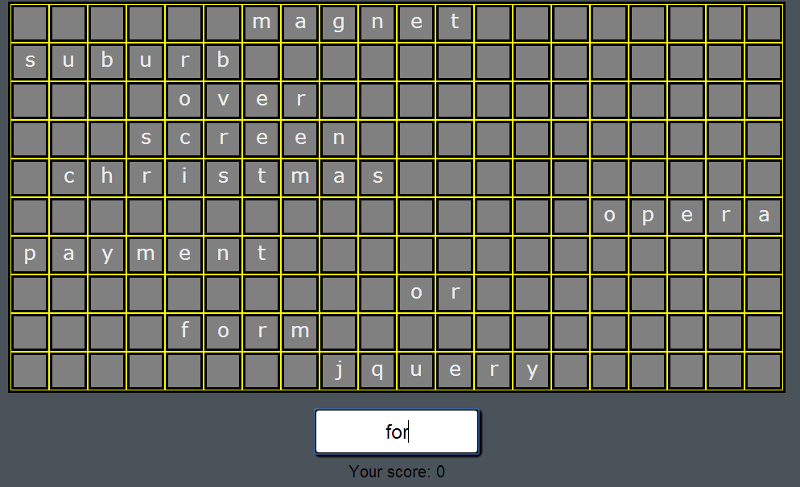

# Word Game

A simple word game where you type words to remove them from the game area. The words descend from the top like in Tetris. You get points for every word removed. The game ends when the game area is full.

You can try the game [here](http://bugi.blanko.fi/~hilloh/sanapeli/).

## Screenshot

